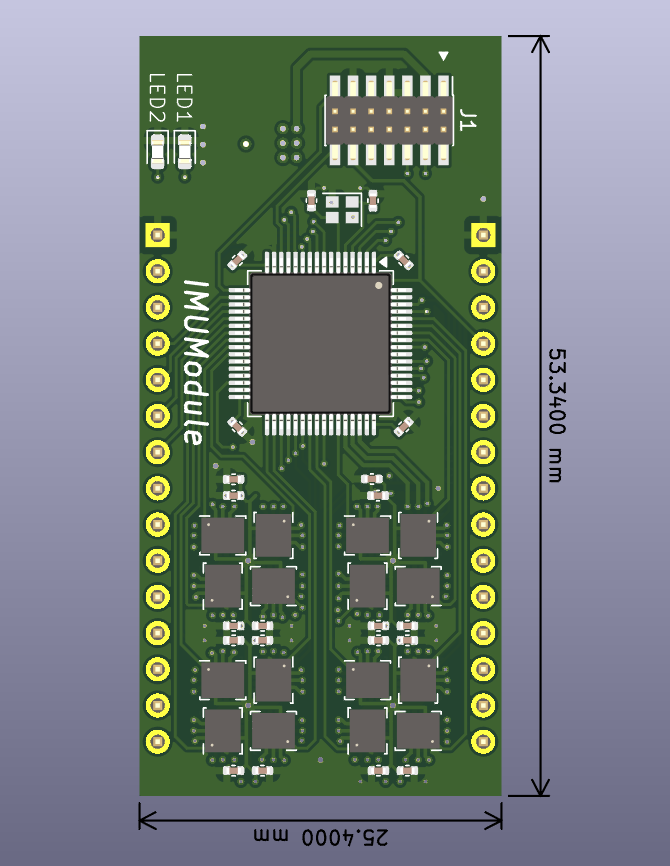
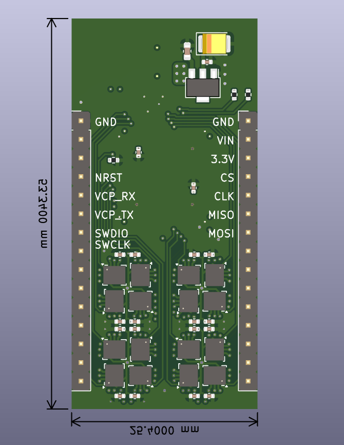

# IMUModule_STM32_PCB

KiCad project to reproduce the contents of the following paper

H. Kamata, M. Kimishima, T. Sawada, Y. Suga, H. Takeda, K. Yamashita, and S. Mitani, MEMS Gyro Array Employing Array Signal Processing for Interference and Outlier Suppression, IEEE Inertial 2020, Hiroshima, Japan

## Firmware
[IMUModule_G473RC](https://github.com/Kotakku/IMUModule_G473RC)

## Board spec
- STM32G473RC
- LSM6DSR (x32)

## Requirements
- KiCad 8
- [KiCAD JLCPCB tools](https://github.com/bouni/kicad-jlcpcb-tools) (for JLCPCB PCBA)

## Production files
Use the files in ```jlcpcb/production_files```
- ```GERBER-IMUModule_STM32.zip```
- ```CPL-IMUModule_STM32.csv```
- ```BOM-IMUModule_STM32.csv```

## Images


